# Design Document: ReLoop by Amazon — Circular Economy Platform

## Overview

ReLoop is a locally-hosted circular economy platform that gives returned and unused products a second life. It combines a Next.js frontend with a Python-based AI service powered by Ollama (local LLM) and YOLO/OpenCV (visual grading) to grade returned items, intelligently route them to their best next destination (resell, refurbish, recycle, donate, or peer exchange), and match surplus goods to anonymous nearby demand.

The system runs entirely on local or self-hosted infrastructure — no paid APIs, no cloud storage, no third-party AI services. Every product gets a digital passport tracking its lifecycle, and every sustainability-positive action earns the user auditable Green Credits.

The platform serves three user personas: consumers returning or passing on products, sellers improving listings to prevent returns, and platform operators monitoring circular economy metrics.

## 1. System Architecture

```mermaid
graph TD
    subgraph Frontend["Next.js App (TypeScript + Tailwind + shadcn/ui)"]
        Pages[Pages / App Router]
        APIRoutes[Next.js API Routes]
        Components[React Components]
    end

    subgraph Backend["Backend Services"]
        Prisma[Prisma ORM]
        DB[(PostgreSQL)]
        FileStore[Local File Storage<br/>/uploads]
    end

    subgraph AIService["FastAPI AI Service (Python)"]
        GradeEndpoint[/grade]
        RewriteEndpoint[/rewrite-listing]
        PriceEndpoint[/price-estimate]
        MatchEndpoint[/nearby-match]
    end

    subgraph LocalAI["Local AI Infrastructure"]
        Ollama[Ollama LLM Server]
        YOLO[YOLO Model File]
        OpenCV[OpenCV Processing]
    end

    Pages --> APIRoutes
    APIRoutes --> Prisma
    Prisma --> DB
    APIRoutes --> FileStore
    APIRoutes --> AIService
    GradeEndpoint --> OpenCV
    GradeEndpoint --> YOLO
    GradeEndpoint --> Ollama
    RewriteEndpoint --> Ollama
    PriceEndpoint --> Ollama
    MatchEndpoint --> DB
```

### Data Flow Summary

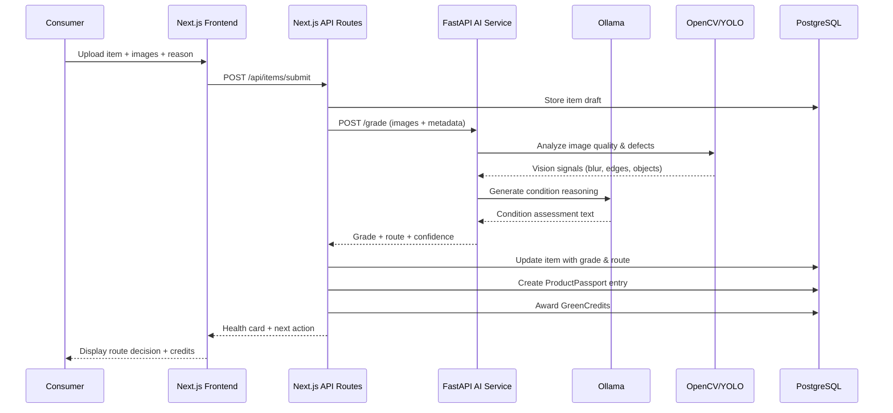

## 2. Frontend Pages

| Route | Page | Purpose |
|-------|------|---------|
| `/` | Home / Dashboard | Hero with live grading demo, platform overview |
| `/submit` | Item Submission | Multi-step form: product details → images → reason → AI grade |
| `/items` | My Items | List of user's submitted items with status badges |
| `/items/[id]` | Item Detail | Full health card, passport, routing decision, credits |
| `/marketplace` | Marketplace | Browse items routed to RESALE with filters |
| `/marketplace/[id]` | Listing Detail | Product info, passport history, price, buy action |
| `/matches` | Nearby Matches | Anonymous need pool matches in user's region |
| `/passport/[id]` | Product Passport | Full lifecycle view: owners, repairs, city trail |
| `/credits` | Green Credits | Credit balance, history, earning breakdown |
| `/seller` | Seller Dashboard | Return patterns, listing rewrites, prevention tips |
| `/seller/listings` | Listing Management | Edit listings with AI rewrite suggestions |
| `/admin` | Admin Panel | System metrics, route distribution, queue management |
| `/settings` | User Settings | Profile, region, notification preferences |

### Page Component Architecture

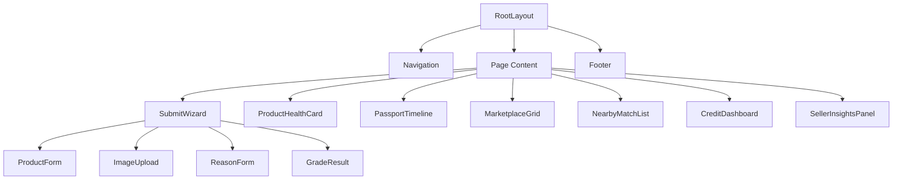

## 3. Backend API Routes (Next.js)

| Method | Route | Purpose |
|--------|-------|---------|
| POST | `/api/items/submit` | Create new item with images |
| GET | `/api/items` | List user's items with filters |
| GET | `/api/items/[id]` | Get single item with health card |
| POST | `/api/items/[id]/grade` | Trigger AI grading for an item |
| PATCH | `/api/items/[id]/route` | Override routing decision (admin) |
| GET | `/api/marketplace` | Browse resale items with search/filter |
| GET | `/api/marketplace/[id]` | Get marketplace listing detail |
| POST | `/api/marketplace/[id]/buy` | Initiate purchase of a resale item |
| GET | `/api/matches` | Get nearby anonymous need matches |
| POST | `/api/matches/accept` | Accept a peer exchange match |
| GET | `/api/passport/[id]` | Get full product passport |
| GET | `/api/credits` | Get user's green credit balance & history |
| GET | `/api/credits/leaderboard` | Regional green credits leaderboard |
| GET | `/api/seller/insights` | Get seller return pattern insights |
| POST | `/api/seller/rewrite` | Request AI listing rewrite |
| GET | `/api/admin/metrics` | Platform-wide circular economy stats |
| POST | `/api/upload` | Handle local file upload (images) |

### Request/Response Interfaces

```typescript
// POST /api/items/submit
interface SubmitItemRequest {
  title: string;
  brand?: string;
  category: ProductCategory;
  sku?: string;
  size?: string;
  region: string;
  returnReason: string;
  details: string;
  images: File[];  // multipart upload
}

interface SubmitItemResponse {
  id: string;
  status: "DRAFT" | "GRADED";
  healthCard?: HealthCardResponse;
}

// GET /api/marketplace
interface MarketplaceQuery {
  category?: ProductCategory;
  region?: string;
  minPrice?: number;
  maxPrice?: number;
  grade?: ConditionGrade;
  page?: number;
  limit?: number;
}

interface MarketplaceResponse {
  items: MarketplaceListing[];
  total: number;
  page: number;
  hasMore: boolean;
}
```

## 4. FastAPI AI Service Endpoints

| Method | Endpoint | Purpose |
|--------|----------|---------|
| GET | `/health` | Service health + model availability check |
| POST | `/grade` | Grade item condition from images + text |
| POST | `/rewrite-listing` | Generate improved listing copy |
| POST | `/price-estimate` | Estimate resale price |
| POST | `/nearby-match` | Score nearby need pool matches |
| POST | `/route-decision` | Full routing decision with reasoning |
| POST | `/passport-summary` | Generate passport summary text |

### AI Service Interface Contracts

```python
# POST /grade
class GradeRequest:
    title: str
    category: str
    reason: str
    details: str = ""
    image: UploadFile | None = None

class GradeResponse:
    title: str
    conditionScore: int          # 0-100
    grade: str                   # A, B, C, D
    route: str                   # RESALE, REFURBISH, DONATE, LIQUIDATE, PEER_EXCHANGE
    confidence: int              # 0-100
    vision: VisionAnalysis
    reasoning: str               # LLM-generated explanation
    defects: list[str]           # Detected defects from YOLO

# POST /price-estimate
class PriceEstimateRequest:
    title: str
    brand: str
    category: str
    grade: str
    conditionScore: int
    originalPrice: float | None = None

class PriceEstimateResponse:
    estimatedPrice: float
    priceRange: tuple[float, float]
    factors: list[str]           # What influenced the price
    confidence: int

# POST /nearby-match
class NearbyMatchRequest:
    category: str
    size: str | None
    region: str
    conditionScore: int

class NearbyMatchResponse:
    matches: list[NeedPoolMatch]
    bestMatch: NeedPoolMatch | None

class NeedPoolMatch:
    poolId: str
    poolName: str
    distanceKm: float
    demand: str                  # High, Medium, Low
    matchScore: int              # 0-100
    note: str
```

## 5. Database Schema (Prisma Models)

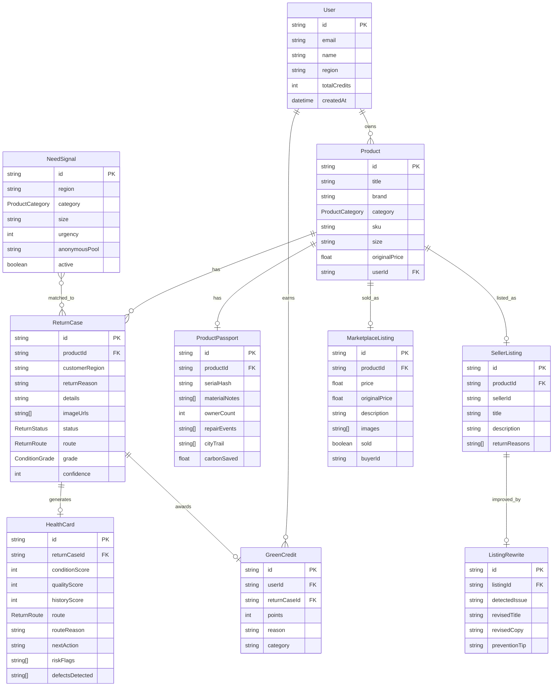

### Key Enumerations

```typescript
enum ProductCategory {
  APPAREL
  FOOTWEAR
  ELECTRONICS
  HOME
  TOYS
  BOOKS
  OTHER
}

enum ReturnRoute {
  RESALE
  REFURBISH
  DONATE
  LIQUIDATE
  PEER_EXCHANGE
}

enum ConditionGrade {
  A    // Near-new, resale-ready
  B    // Good, minor issues
  C    // Fair, needs intervention
  D    // Poor, liquidation/parts
}

enum ReturnStatus {
  DRAFT       // Submitted, awaiting grade
  GRADED      // AI grading complete
  ROUTED      // Route decision finalized
  LISTED      // On marketplace or matched
  COMPLETED   // Transaction done
}
```

## 6. AI Grading Pipeline

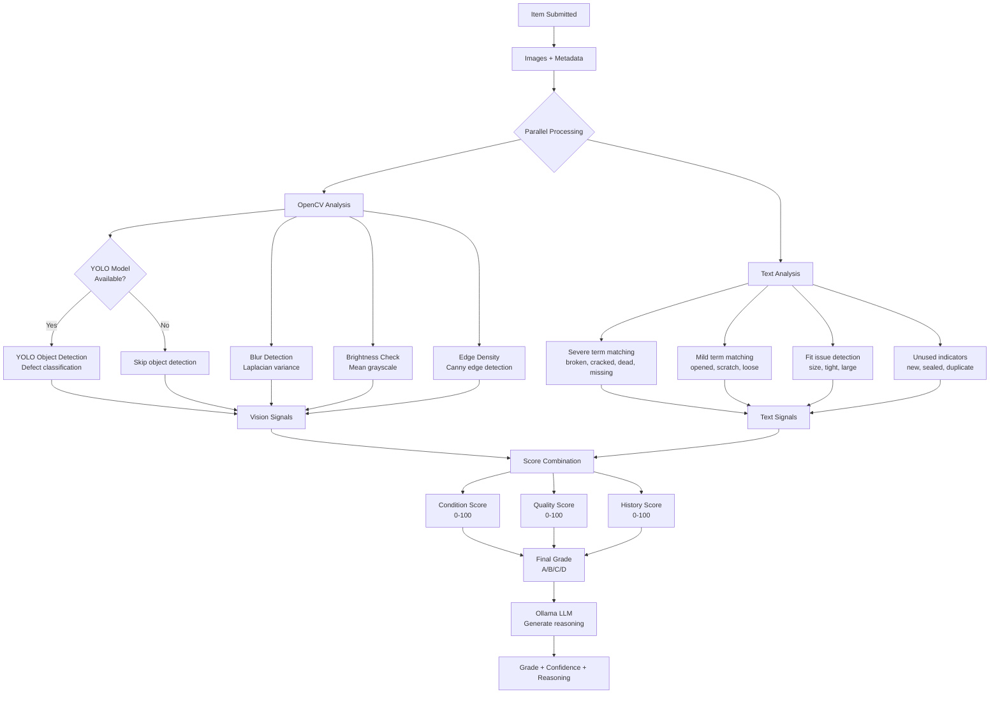

### Scoring Formula

```typescript
// Vision signals
clarityBonus = isImageClear ? 8 : 0
yoloDefects = yoloDetectedDefects.length

// Text signals  
severeCount = countMatches(text, ["broken", "cracked", "dead", "missing", "fake", "torn"])
mildCount = countMatches(text, ["opened", "scratch", "loose", "box", "minor"])
unusedCount = countMatches(text, ["unused", "new", "sealed", "wrong", "duplicate", "gift"])
imageSignal = min(imageCount * 5, 15)

// Score computation
conditionScore = clamp(88 + imageSignal + unusedCount*4 - severeCount*22 - mildCount*7 - yoloDefects*10, 12, 98)
qualityScore = clamp(82 + clarityBonus - severeCount*16 - fitCount*4 - yoloDefects*8, 18, 96)
historyScore = clamp(78 + unusedCount*5 - severeCount*10 - mildCount*3, 20, 94)

// Grade assignment
confidence = average(conditionScore, qualityScore, historyScore)
grade = confidence >= 86 ? "A" : confidence >= 70 ? "B" : confidence >= 52 ? "C" : "D"
```

### YOLO/OpenCV Processing Detail

| Stage | Tool | Purpose | Output |
|-------|------|---------|--------|
| 1. Decode | OpenCV `imdecode` | Convert uploaded bytes to frame | BGR numpy array |
| 2. Blur check | Laplacian variance | Detect blurry/unusable images | Float score (>80 = clear) |
| 3. Brightness | Grayscale mean | Detect over/under-exposed images | Float (45-220 = acceptable) |
| 4. Edge density | Canny edge detection | Measure visible detail/texture | Float percentage |
| 5. Object detection | YOLOv8 (when configured) | Identify defects, missing parts | List of detected objects |
| 6. LLM reasoning | Ollama | Natural language explanation | Condition narrative |

## 7. Routing Decision Algorithm

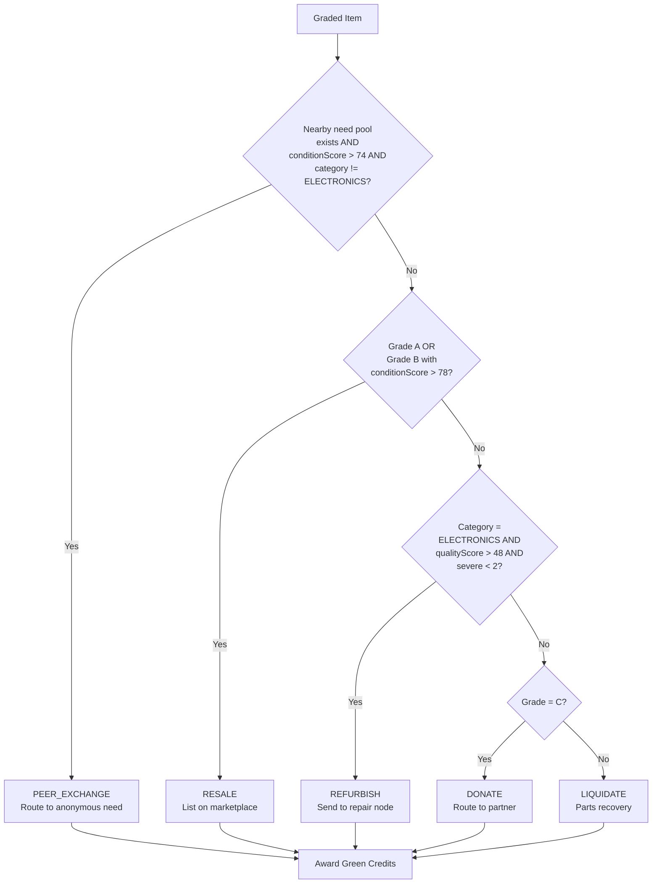

### Routing Decision Table

| Priority | Condition | Route | Green Credits |
|----------|-----------|-------|---------------|
| 1 | Nearby need match + condition > 74 + not electronics | PEER_EXCHANGE | 45 |
| 2 | Grade A, or Grade B + condition > 78 | RESALE | 30 |
| 3 | Electronics + quality > 48 + severe < 2 | REFURBISH | 30 |
| 4 | Grade C | DONATE | 40 |
| 5 | Everything else (Grade D) | LIQUIDATE | 10 |

### Routing Input Signals

```typescript
interface RoutingInput {
  grade: "A" | "B" | "C" | "D";
  conditionScore: number;
  qualityScore: number;
  category: ProductCategory;
  region: string;
  severeDefectCount: number;
  nearbyNeedMatch?: NeedPoolMatch;
}

interface RoutingOutput {
  route: ReturnRoute;
  reason: string;
  nextAction: string;
  greenCredits: number;
  confidence: number;
}
```

## 8. Pricing Algorithm

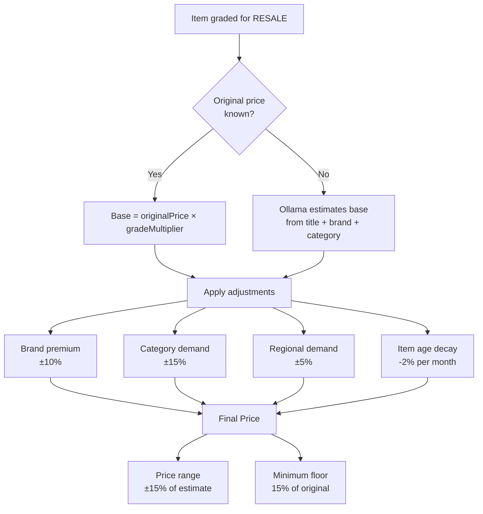

### Pricing Formula

```typescript
interface PricingFactors {
  originalPrice?: number;
  grade: ConditionGrade;
  brand: string;
  category: ProductCategory;
  region: string;
  itemAgeMonths: number;
}

// Grade multipliers (percentage of original price)
const gradeMultipliers: Record<ConditionGrade, number> = {
  A: 0.70,  // 70% of original
  B: 0.50,  // 50% of original
  C: 0.30,  // 30% of original
  D: 0.15,  // 15% of original (liquidation)
};

// Category demand multipliers
const categoryDemand: Record<ProductCategory, number> = {
  ELECTRONICS: 1.15,   // High resale demand
  FOOTWEAR: 1.05,      // Moderate
  APPAREL: 0.90,       // Lower (fast fashion)
  HOME: 1.00,          // Neutral
  BOOKS: 0.85,         // Low margins
  TOYS: 0.95,          // Seasonal
  OTHER: 1.00,         // Neutral
};

function estimatePrice(factors: PricingFactors): PriceEstimate {
  const basePrice = factors.originalPrice
    ? factors.originalPrice * gradeMultipliers[factors.grade]
    : ollamaEstimateBase(factors.brand, factors.category);

  const adjusted = basePrice
    * categoryDemand[factors.category]
    * brandPremium(factors.brand)
    * Math.max(0.6, 1 - factors.itemAgeMonths * 0.02);

  const floor = (factors.originalPrice ?? adjusted) * 0.15;
  const finalPrice = Math.max(floor, adjusted);

  return {
    estimatedPrice: Math.round(finalPrice),
    priceRange: [Math.round(finalPrice * 0.85), Math.round(finalPrice * 1.15)],
    confidence: factors.originalPrice ? 82 : 60,
  };
}
```

### Ollama Fallback Pricing

When `originalPrice` is unknown, the system prompts Ollama with:
- Product title and brand
- Category and condition grade
- Known market context (local database of past sales)

The LLM returns a rough estimate that's bounded by category-level min/max constraints.

## 9. Nearby Matching Algorithm

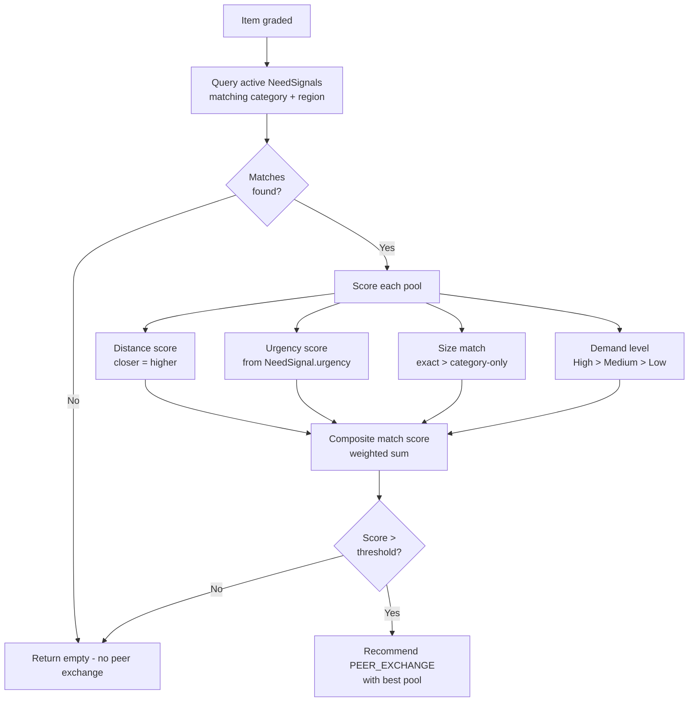

### Matching Scoring Formula

```typescript
interface MatchScoring {
  distanceWeight: 0.30;    // Closer is better
  urgencyWeight: 0.25;     // Higher urgency = priority
  sizeMatchWeight: 0.25;   // Exact size match bonus
  demandWeight: 0.20;      // Pool demand level
}

function scoreNeedPool(item: GradedItem, pool: NeedSignal): number {
  const distanceScore = Math.max(0, 100 - pool.distanceKm * 10);  // 10km = 0
  const urgencyScore = pool.urgency * 10;                           // 1-10 scale → 10-100
  const sizeScore = item.size === pool.size ? 100 : (pool.size === null ? 60 : 20);
  const demandScore = { High: 100, Medium: 65, Low: 30 }[pool.demand];

  return (
    distanceScore * 0.30 +
    urgencyScore * 0.25 +
    sizeScore * 0.25 +
    demandScore * 0.20
  );
}

const MATCH_THRESHOLD = 55;  // Minimum score to recommend peer exchange
```

### Privacy-Preserving Design

- Need signals are stored with `anonymousPool` identifier, never individual identity
- Matching happens at pool level, not person level
- Handoff uses Amazon-managed pickup/dropoff — no direct contact
- No chat, no identity exchange between parties
- Region stored as neighborhood-level granularity (e.g., "North Bengaluru")

## 10. Product Passport Design

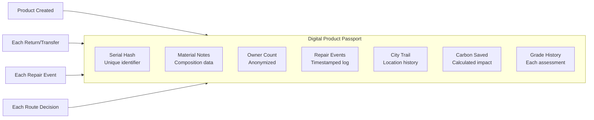

### Passport Data Structure

```typescript
interface ProductPassport {
  id: string;
  productId: string;
  serialHash: string;              // SHA-256 of product serial/identifier
  materialNotes: string[];         // ["100% recycled polyester", "rubber sole"]
  ownerCount: number;              // Incremented on each transfer
  repairEvents: RepairEvent[];     // Log of all repairs
  cityTrail: string[];             // ["Mumbai", "Bengaluru"] — city-level only
  gradeHistory: GradeSnapshot[];   // Grade at each assessment
  carbonSaved: number;             // kg CO₂ equivalent saved
  createdAt: Date;
  updatedAt: Date;
}

interface RepairEvent {
  date: string;
  type: "refurbish" | "clean" | "part_replace" | "repackage";
  description: string;
  gradeAfter: ConditionGrade;
}

interface GradeSnapshot {
  date: string;
  grade: ConditionGrade;
  conditionScore: number;
  route: ReturnRoute;
}
```

### Passport Lifecycle Events

| Event | Trigger | Passport Update |
|-------|---------|-----------------|
| Creation | First item submission | Initialize passport with material data |
| Grading | AI grades item | Add grade snapshot |
| Routing | Route decision made | Record route + carbon impact |
| Transfer | Item changes hands | Increment ownerCount, add city |
| Repair | Item refurbished | Add repair event, new grade |
| Resale | Item sold on marketplace | Update owner count + city trail |
| Donation | Item donated | Record donation + carbon saved |

### Carbon Calculation

```typescript
const carbonPerRoute: Record<ReturnRoute, number> = {
  RESALE: 4.2,          // kg CO₂ saved vs. manufacturing new
  REFURBISH: 3.1,       // Partial savings (some resources used)
  DONATE: 3.8,          // Extends product life
  PEER_EXCHANGE: 4.5,   // Best: local, no shipping
  LIQUIDATE: 1.2,       // Partial material recovery
};
```

## 11. Green Credits System

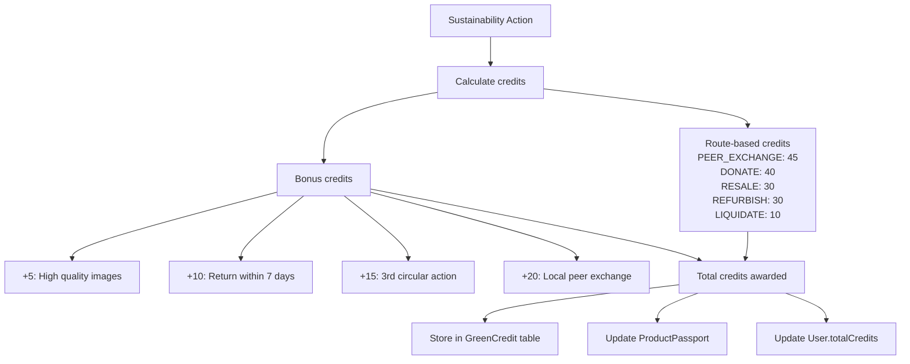

### Credit Earning Rules

| Action | Base Credits | Condition |
|--------|-------------|-----------|
| Route to PEER_EXCHANGE | 45 | Anonymous nearby match accepted |
| Route to DONATE | 40 | Item donated to verified partner |
| Route to RESALE | 30 | Item listed and sold |
| Route to REFURBISH | 30 | Item sent for repair |
| Route to LIQUIDATE | 10 | Material recovery |
| High-quality images | +5 | 3+ clear images uploaded |
| Quick return | +10 | Submitted within 7 days of purchase |
| Repeat circular action | +15 | User's 3rd+ action |
| Local exchange | +20 | Peer exchange under 5km |

### Credit System Interface

```typescript
interface GreenCredit {
  id: string;
  userId: string;
  returnCaseId: string;
  points: number;
  reason: string;
  category: "route" | "bonus_quality" | "bonus_speed" | "bonus_repeat" | "bonus_local";
  createdAt: Date;
}

interface CreditSummary {
  totalCredits: number;
  thisMonth: number;
  rank: number;               // Regional leaderboard position
  carbonSavedKg: number;      // Total environmental impact
  actionsCount: number;       // Total circular actions
  breakdown: {
    route: number;
    bonuses: number;
  };
}
```

## 12. Folder Structure

```
reloop/
├── .kiro/
│   └── specs/
│       └── reloop/
│           ├── .config.kiro
│           ├── design.md
│           ├── requirements.md
│           └── tasks.md
├── ai-service/
│   ├── main.py                    # FastAPI app entry point
│   ├── requirements.txt           # Python dependencies
│   ├── grading/
│   │   ├── __init__.py
│   │   ├── vision.py              # OpenCV image analysis
│   │   ├── yolo.py                # YOLO object detection
│   │   ├── text_analysis.py       # Text signal extraction
│   │   └── scorer.py              # Score combination logic
│   ├── routing/
│   │   ├── __init__.py
│   │   ├── decision.py            # Route decision algorithm
│   │   └── matching.py            # Nearby need matching
│   ├── pricing/
│   │   ├── __init__.py
│   │   └── estimator.py           # Price estimation logic
│   ├── llm/
│   │   ├── __init__.py
│   │   └── ollama.py              # Ollama client wrapper
│   └── models/
│       ├── __init__.py
│       └── schemas.py             # Pydantic request/response models
├── prisma/
│   ├── schema.prisma              # Database schema
│   ├── migrations/                # Migration history
│   └── seed.ts                    # Seed data
├── public/
│   └── uploads/                   # Local file storage for images
├── src/
│   ├── app/
│   │   ├── layout.tsx             # Root layout
│   │   ├── page.tsx               # Home / Dashboard
│   │   ├── globals.css            # Tailwind base styles
│   │   ├── submit/
│   │   │   └── page.tsx           # Item submission wizard
│   │   ├── items/
│   │   │   ├── page.tsx           # My items list
│   │   │   └── [id]/
│   │   │       └── page.tsx       # Item detail + health card
│   │   ├── marketplace/
│   │   │   ├── page.tsx           # Browse resale items
│   │   │   └── [id]/
│   │   │       └── page.tsx       # Listing detail
│   │   ├── matches/
│   │   │   └── page.tsx           # Nearby matches
│   │   ├── passport/
│   │   │   └── [id]/
│   │   │       └── page.tsx       # Product passport view
│   │   ├── credits/
│   │   │   └── page.tsx           # Green credits dashboard
│   │   ├── seller/
│   │   │   ├── page.tsx           # Seller dashboard
│   │   │   └── listings/
│   │   │       └── page.tsx       # Listing management
│   │   ├── admin/
│   │   │   └── page.tsx           # Admin panel
│   │   ├── settings/
│   │   │   └── page.tsx           # User settings
│   │   └── api/
│   │       ├── items/
│   │       │   ├── route.ts       # GET list, POST create
│   │       │   └── [id]/
│   │       │       ├── route.ts   # GET detail, PATCH update
│   │       │       └── grade/
│   │       │           └── route.ts
│   │       ├── marketplace/
│   │       │   ├── route.ts       # GET browse
│   │       │   └── [id]/
│   │       │       ├── route.ts   # GET detail
│   │       │       └── buy/
│   │       │           └── route.ts
│   │       ├── matches/
│   │       │   ├── route.ts       # GET matches
│   │       │   └── accept/
│   │       │       └── route.ts   # POST accept
│   │       ├── passport/
│   │       │   └── [id]/
│   │       │       └── route.ts   # GET passport
│   │       ├── credits/
│   │       │   ├── route.ts       # GET balance
│   │       │   └── leaderboard/
│   │       │       └── route.ts
│   │       ├── seller/
│   │       │   ├── insights/
│   │       │   │   └── route.ts
│   │       │   └── rewrite/
│   │       │       └── route.ts
│   │       ├── admin/
│   │       │   └── metrics/
│   │       │       └── route.ts
│   │       └── upload/
│   │           └── route.ts       # POST file upload
│   ├── components/
│   │   ├── ui/                    # shadcn/ui components
│   │   │   ├── badge.tsx
│   │   │   ├── button.tsx
│   │   │   ├── card.tsx
│   │   │   ├── input.tsx
│   │   │   ├── label.tsx
│   │   │   ├── progress.tsx
│   │   │   ├── tabs.tsx
│   │   │   └── textarea.tsx
│   │   ├── layout/
│   │   │   ├── navigation.tsx
│   │   │   └── footer.tsx
│   │   ├── items/
│   │   │   ├── submit-wizard.tsx
│   │   │   ├── health-card.tsx
│   │   │   ├── item-list.tsx
│   │   │   └── image-upload.tsx
│   │   ├── marketplace/
│   │   │   ├── listing-card.tsx
│   │   │   └── marketplace-grid.tsx
│   │   ├── passport/
│   │   │   └── passport-timeline.tsx
│   │   ├── credits/
│   │   │   ├── credit-dashboard.tsx
│   │   │   └── leaderboard.tsx
│   │   └── seller/
│   │       ├── insights-panel.tsx
│   │       └── rewrite-card.tsx
│   ├── lib/
│   │   ├── utils.ts               # Utility functions (cn, etc.)
│   │   ├── reloop.ts              # Core business logic
│   │   ├── prisma.ts              # Prisma client singleton
│   │   ├── ai-client.ts           # FastAPI service client
│   │   └── upload.ts              # File upload utilities
│   └── types/
│       └── index.ts               # Shared TypeScript types
├── .env.example                   # Environment variable template
├── .gitignore
├── eslint.config.mjs
├── next.config.ts
├── package.json
├── postcss.config.mjs
├── tailwind.config.ts
└── tsconfig.json
```

## 13. Build Phases (Implementation Roadmap)

```mermaid
gantt
    title ReLoop Implementation Phases
    dateFormat  X
    axisFormat %s

    section Phase 1: Foundation
    Database schema + migrations          :p1a, 0, 2
    Local file upload system              :p1b, 0, 1
    Prisma client + seed data             :p1c, 1, 2
    Basic API routes (CRUD)               :p1d, 2, 3

    section Phase 2: AI Core
    OpenCV image analysis                 :p2a, 3, 4
    YOLO stub + integration hook          :p2b, 3, 4
    Grading scoring engine                :p2c, 4, 5
    Ollama integration                    :p2d, 4, 5
    Routing decision algorithm            :p2e, 5, 6

    section Phase 3: Features
    Item submission wizard                :p3a, 6, 7
    Health card display                   :p3b, 6, 7
    Marketplace browse + buy              :p3c, 7, 8
    Pricing algorithm                     :p3d, 7, 8
    Product passport                      :p3e, 8, 9

    section Phase 4: Social
    Nearby matching algorithm             :p4a, 9, 10
    Green credits system                  :p4b, 9, 10
    Seller dashboard + rewrites           :p4c, 10, 11
    Leaderboard + metrics                 :p4d, 11, 12

    section Phase 5: Polish
    Admin panel                           :p5a, 12, 13
    UI polish + responsive design         :p5b, 12, 13
    End-to-end testing                    :p5c, 13, 14
    Performance optimization              :p5d, 13, 14
```

### Phase Breakdown

#### Phase 1: Foundation (Week 1-2)
- Run Prisma migrations against PostgreSQL
- Implement local file upload to `public/uploads/`
- Create Prisma client singleton with connection pooling
- Build basic CRUD API routes for items, users, credits
- Seed database with sample products and need signals
- Set up shared TypeScript types

#### Phase 2: AI Core (Week 3-4)
- Modularize FastAPI service into grading/routing/pricing modules
- Implement full OpenCV pipeline (blur, brightness, edges)
- Wire YOLO model loading when `YOLO_MODEL_PATH` is configured
- Build composite scoring engine with configurable weights
- Connect Ollama for reasoning generation and price estimation
- Implement routing decision algorithm with all priority rules

#### Phase 3: Features (Week 5-6)
- Build multi-step item submission wizard with image preview
- Create health card component with grade visualization
- Implement marketplace with search, filter, and pagination
- Build pricing algorithm with grade multipliers and adjustments
- Create product passport timeline view
- Wire marketplace buy flow (no payment — local demo)

#### Phase 4: Social (Week 7-8)
- Implement nearby matching with scoring formula
- Build green credits earning and tracking
- Create seller dashboard with return pattern detection
- Integrate Ollama-powered listing rewrite suggestions
- Build regional leaderboard
- Add admin metrics dashboard

#### Phase 5: Polish (Week 9-10)
- Admin panel for route overrides and queue management
- Responsive design pass on all pages
- End-to-end flow testing (submit → grade → route → complete)
- Performance optimization (image processing, DB queries)
- Documentation and deployment guide

## Error Handling

### Error Categories

| Category | Example | Response |
|----------|---------|----------|
| AI Service Down | FastAPI not running | Fallback to text-only grading (no vision) |
| Ollama Unavailable | LLM server not responding | Use hardcoded reasoning templates |
| Image Decode Failure | Corrupt upload | Return `is_clear: false`, skip vision scoring |
| YOLO Model Missing | No model file configured | Skip object detection, use OpenCV only |
| Database Connection | PostgreSQL unreachable | Return 503 with retry guidance |
| File Upload Failure | Disk full or permission | Return 507, suggest clearing uploads |

### Graceful Degradation Strategy

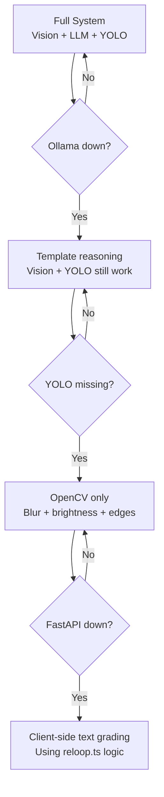

## Testing Strategy

### Unit Testing
- Score computation functions (deterministic, pure functions)
- Routing decision logic for each priority path
- Pricing calculations with known inputs
- Green credit award computation

### Integration Testing
- Full grading pipeline: upload → vision → score → route
- API route handlers with mocked Prisma client
- FastAPI endpoints with test images
- Ollama integration with timeout handling

### Property-Based Testing
- **Library**: fast-check (TypeScript), hypothesis (Python)
- Grading scores always within bounds (12-98, 18-96, 20-94)
- Route decision is deterministic for same inputs
- Green credits are always positive integers
- Pricing never goes below floor (15% of original)
- Match scores are bounded 0-100

## Dependencies

| Component | Dependency | Version | Purpose |
|-----------|------------|---------|---------|
| Frontend | Next.js | 15.x | App Router, SSR, API routes |
| Frontend | React | 19.x | UI rendering |
| Frontend | Tailwind CSS | 3.x | Styling |
| Frontend | shadcn/ui | latest | Component library |
| Frontend | Lucide React | latest | Icons |
| ORM | Prisma | 6.x | Database access |
| Database | PostgreSQL | 15+ | Primary data store |
| AI Service | FastAPI | 0.115.x | Python API framework |
| AI Service | OpenCV | 4.10.x | Image analysis |
| AI Service | NumPy | 2.x | Array operations |
| AI Service | Requests | 2.x | HTTP client for Ollama |
| LLM | Ollama | latest | Local LLM inference |
| Vision | YOLOv8 | optional | Object/defect detection |
| Storage | Local filesystem | — | Image uploads |


## Correctness Properties

*A property is a characteristic or behavior that should hold true across all valid executions of a system — essentially, a formal statement about what the system should do. Properties serve as the bridge between human-readable specifications and machine-verifiable correctness guarantees.*

### Property 1: Grading Score Bounds

*For any* valid return draft (any combination of text content, image count, and category), the Grading_Engine SHALL produce a ConditionScore in [12, 98], a QualityScore in [18, 96], and a HistoryScore in [20, 94].

**Validates: Requirements 2.1, 2.2, 2.3**

### Property 2: Score Term Impact (Metamorphic)

*For any* return draft, adding a severe defect term to the text SHALL reduce the ConditionScore by exactly 22 (or clamp at the lower bound), adding a mild term SHALL reduce it by exactly 7 (or clamp), and adding an unused indicator SHALL increase it by exactly 4 (or clamp at the upper bound).

**Validates: Requirements 2.4, 2.5, 2.6**

### Property 3: Grade Threshold Assignment

*For any* grading result, the assigned grade SHALL be A when confidence >= 86, B when 70 <= confidence <= 85, C when 52 <= confidence <= 69, and D when confidence < 52, where confidence is the average of the three scores.

**Validates: Requirements 2.7**

### Property 4: Grading Determinism

*For any* valid return draft, calling the Grading_Engine twice with identical inputs SHALL produce identical outputs (same grade, same scores, same route).

**Validates: Requirements 2.13**

### Property 5: Routing Decision Correctness

*For any* graded item with known scores, grade, category, defect count, and optional nearby need match, the Routing_Algorithm SHALL assign exactly one route following priority order: PEER_EXCHANGE (when need match exists AND conditionScore > 74 AND category != ELECTRONICS), then RESALE (when grade A, or grade B with conditionScore > 78), then REFURBISH (when ELECTRONICS AND qualityScore > 48 AND severe < 2), then DONATE (when grade C), then LIQUIDATE (default).

**Validates: Requirements 3.1, 3.2, 3.3, 3.4, 3.5, 3.6, 3.7**

### Property 6: Price Floor Invariant

*For any* item with a known original price, the Pricing_Algorithm SHALL produce a final estimated price that is greater than or equal to 15% of the original price.

**Validates: Requirements 4.5**

### Property 7: Price Range Symmetry

*For any* pricing result, the returned price range SHALL be [estimatedPrice × 0.85, estimatedPrice × 1.15], representing a symmetric ±15% band around the estimate.

**Validates: Requirements 4.6**

### Property 8: Pricing Calculation Correctness

*For any* item with a known original price, grade, category, and item age, the Pricing_Algorithm SHALL compute the price as: originalPrice × gradeMultiplier × categoryDemand × max(0.60, 1 - age×0.02) × brandPremium, and report confidence 82 when original price is known, 60 when unknown.

**Validates: Requirements 4.1, 4.3, 4.4, 4.7**

### Property 9: Match Score Bounds and Computation

*For any* item-pool pair, the Matching_Engine SHALL produce a composite score bounded in [0, 100] computed as: distanceScore×0.30 + urgencyScore×0.25 + sizeScore×0.25 + demandScore×0.20, where distanceScore = max(0, 100 - distanceKm×10), sizeScore is 100 (exact), 60 (no requirement), or 20 (mismatch), urgencyScore = urgency×10, and demandScore is 100 (High), 65 (Medium), or 30 (Low).

**Validates: Requirements 5.2, 5.3, 5.4, 5.7**

### Property 10: Match Threshold Gate

*For any* matching result, the system SHALL recommend PEER_EXCHANGE as a route only when the composite match score exceeds 55.

**Validates: Requirements 5.5**

### Property 11: Passport Transfer Consistency

*For any* sequence of ownership transfers on a product, each transfer SHALL increment ownerCount by exactly 1 and append exactly one city to the cityTrail, resulting in cityTrail.length equaling ownerCount after initialization.

**Validates: Requirements 6.3**

### Property 12: Carbon Savings Calculation

*For any* routed item, the Product_Passport SHALL calculate carbon saved as the route-specific constant: PEER_EXCHANGE → 4.5 kg, RESALE → 4.2 kg, DONATE → 3.8 kg, REFURBISH → 3.1 kg, LIQUIDATE → 1.2 kg.

**Validates: Requirements 6.5**

### Property 13: Green Credits Positive Integer Invariant

*For any* credit award event, the Green_Credits_System SHALL award a positive integer amount. Base credits follow the route mapping: PEER_EXCHANGE 45, DONATE 40, RESALE 30, REFURBISH 30, LIQUIDATE 10. All bonus amounts are positive integers.

**Validates: Requirements 7.1, 7.7**

### Property 14: User Credit Balance Consistency

*For any* user, the totalCredits balance SHALL equal the sum of all individual GreenCredit record points associated with that user.

**Validates: Requirements 7.8**

### Property 15: Marketplace Filter Invariant

*For any* marketplace query result, every returned item SHALL have route RESALE and status LISTED. When filters are applied (category, region, price range, grade), every returned item SHALL match all specified filter criteria.

**Validates: Requirements 8.1, 8.2**

### Property 16: Pagination Correctness

*For any* paginated marketplace query, the number of returned items SHALL not exceed the page size, and the hasMore indicator SHALL be true if and only if there are additional items beyond the current page.

**Validates: Requirements 8.4**

### Property 17: Input Validation Rejection

*For any* submission payload missing a title or category, the Submission_Wizard SHALL reject it. *For any* uploaded file that is not JPEG, PNG, or WebP format, the system SHALL reject it with a descriptive error.

**Validates: Requirements 1.2, 12.2, 12.3**
