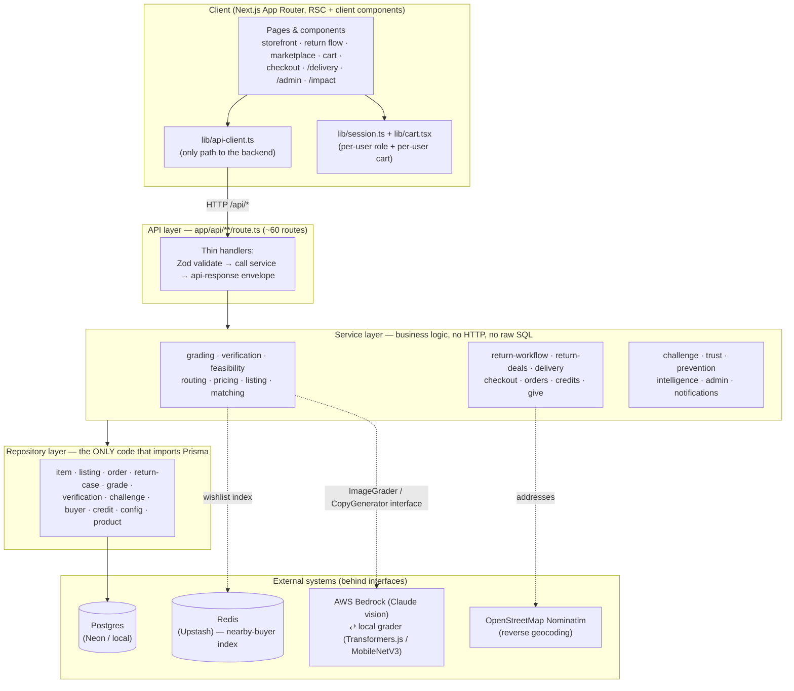
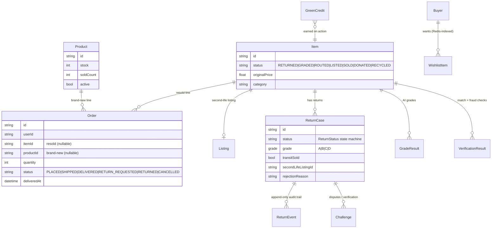
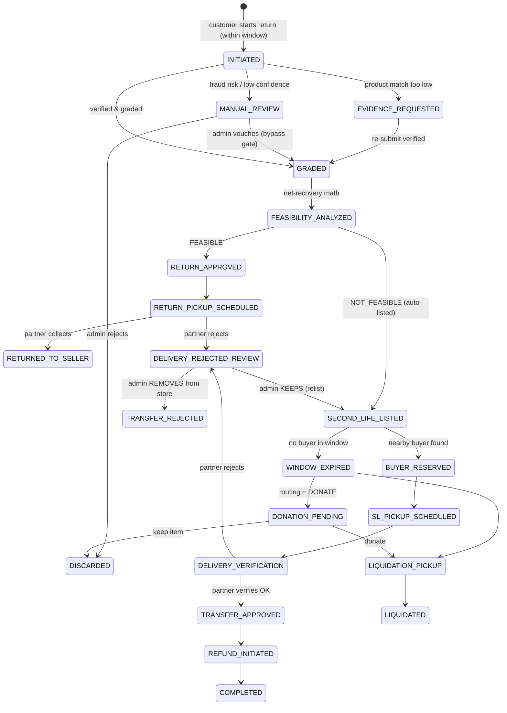
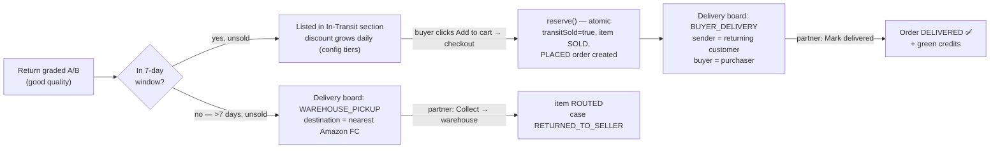
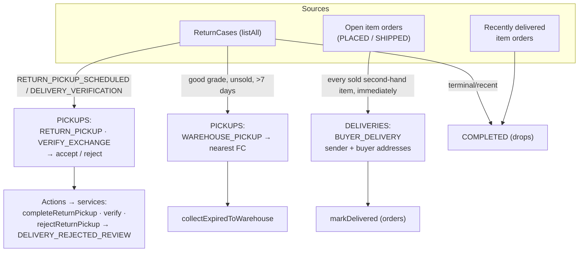
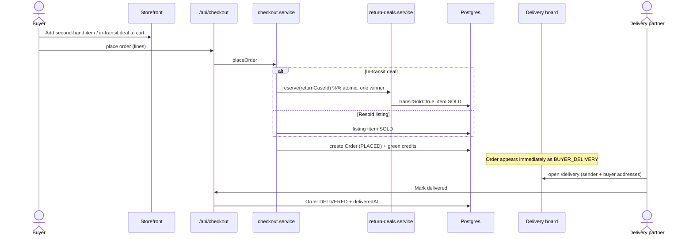

# Amazon Nemo — Technical Architecture

This document covers the **system architecture**, **data model**, and the key
**workflows** (return-decision state machine, in-transit deal lifecycle, the delivery-partner
board, and delivery-rejection review). Diagrams are [Mermaid](https://mermaid.js.org/) — they
render on GitHub and in most Markdown viewers.

---

## 1. Layered architecture

A strict layered architecture — **a layer only ever talks to the one below it**. The API is
thin HTTP, services hold all business logic, repositories are the only code that touches the
database, and external systems are reached behind interfaces so they're swappable.

### Principles
- **Nothing hardcoded.** Secrets in Zod-validated env (app refuses to boot if missing). Every
  business rule lives in the **`RoutingConfig`** table — thresholds, radii, price bands,
  discount tiers, the 7-day transit window, CO₂ factors, credit rates — changeable live.
- **Swap by interface.** Grading depends on an `ImageGrader` contract, not Bedrock; listing
  copy on a `ListingCopyGenerator`. Switching providers is one config value.
- **Resilience.** Bedrock failure → automatic fall-back to the local grader (the demo never
  dead-ends).
- **Type safety end to end.** Prisma types from the schema; Zod at every boundary.

---

## 2. Data model (core entities)

> The **`Order`** row is the hinge between the two ecosystems and the delivery board: an
> item-backed order that is `PLACED`/`SHIPPED` becomes a *buyer delivery*; one that is
> `DELIVERED` recently shows as *completed*.

---

## 3. Return-decision workflow (state machine)

The brain of the product. Each transition is persisted with an audit `ReturnEvent`. Decisions
come only from the grading / verification / feasibility / routing / matching engines.

**Delivery-rejection review** (new): when a delivery partner rejects a second-hand item — at
return pickup *or* at second-life verification — the case parks in `DELIVERY_REJECTED_REVIEW`
instead of terminally rejecting. An admin (Operations Console → **Rejections**) then chooses:
- **Keep in inventory** → relist (reactivate or recreate the listing, item → `LISTED`, reopen
  the Second Life window).
- **Remove from store** → deactivate the listing and route the item out of inventory
  (item → `ROUTED`), so it can't be sold again.

---

## 4. Return-in-Transit deal lifecycle

A good-grade return is sold *before* warehouse intake — at a discount that grows with days in
the pipeline — for a **7-day** window (`config.returnTransitArrivalDays`).

The discount is derived from elapsed days **at read time**, so the "daily recalculation"
happens implicitly on every request. The price is re-computed authoritatively at checkout.

---

## 5. Delivery-partner board (`/delivery`)

The board (`delivery.service.board()`) composes three task families from live data — return
cases **and** orders — and reverse-geocodes real street addresses (with safe fallbacks).

**Address resolution (deterministic for the demo):** buyer = `pointFromSeed(userId)`; sender
= the returning customer's pickup origin for an in-transit sale, else
`pointFromSeed(itemId:seller)`; all reverse-geocoded via Nominatim (cached, timeout-tolerant).

---

## 6. End-to-end purchase + delivery sequence

---

## 7. Where things live

| Concern | File(s) |
|---|---|
| Per-user cart | `src/lib/cart.tsx` (storage key `nemo-cart-v2::<userId>`) |
| Roles / session | `src/lib/session.ts`, `src/lib/user-context.tsx` |
| Return state machine | `src/services/return-workflow/return-workflow.service.ts` |
| In-transit deals | `src/services/return-deals/return-deals.service.ts` |
| Delivery board | `src/services/delivery/delivery.service.ts` |
| Checkout (both ecosystems) | `src/services/checkout/checkout.service.ts` |
| Grading (swappable) | `src/services/grading/*` (bedrock · local · clip · kaputt) |
| Live business rules | `RoutingConfig` table + `config.repository.ts` |
| Admin Operations Console | `src/app/admin/page.tsx` + `src/components/admin/*` |

---

*Build the backend until it's provably correct. Then build a frontend it can be proud of.
Then ship the bridge.*
